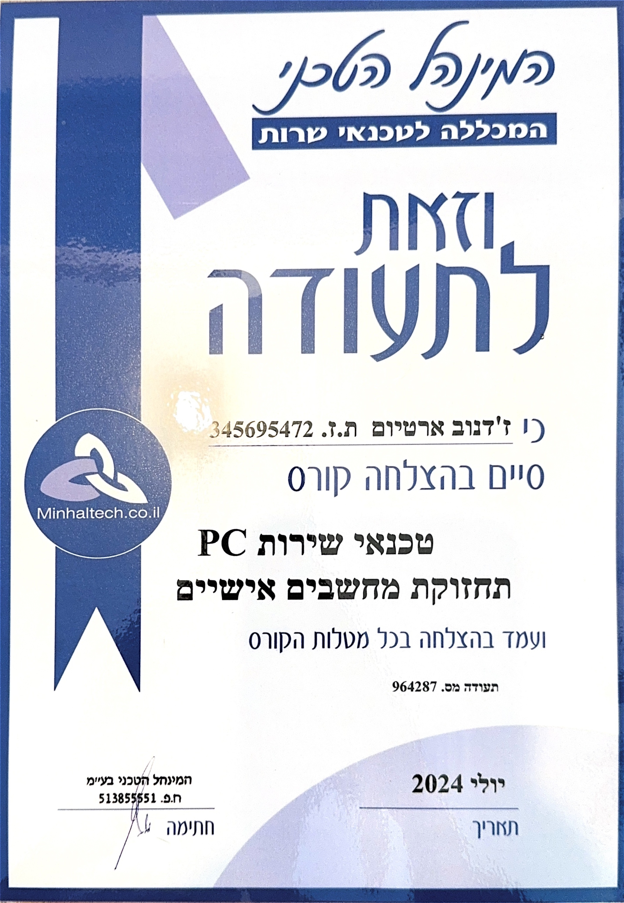
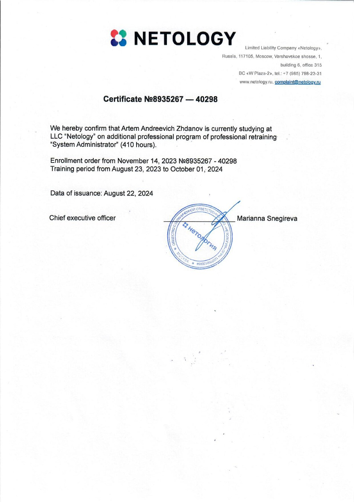

# Curriculum Vitae

**Name:** Artyom Zhdanov  
**Address:** Givatayim, Knesset St. 32  
**Date of Birth:** 18/04/1994  
**Phone:** +972-53-3578413  
**Email:** strrazv@gmail.com  

**Languages:**
- **Hebrew:** B+ (Continuing studies)
- **English:** B2 (Continuing studies)

## Education

- **09.2023 - 10.2024**: Professional Program at Netology: Linux System Administration, 410-hour course. Subjects studied:
  - Introduction to IT systems and Linux-based operating systems: comprehensive introduction to Linux, basic commands, and day-to-day operations.
  - Linux system administration: user management, file management, network configuration, and automation processes to improve efficiency.
  - Bash programming: creating complex scripts to automate tasks, file handling, and filesystem management.
  - Virtualization: setting up virtual servers and managing virtual infrastructure.
  - CI/CD: implementation of automation tools such as Jenkins, Git, and Docker, building continuous integration and continuous delivery processes.
  - System reliability and resilience: ensuring system availability and handling failures using advanced tools and methods.
  - Data management and storage: data handling and storage, including configuring advanced storage systems and managing backup systems.

- **10.2023 - 07.2024**: Courses at Minhaltech: Computer Technician (Windows). Subjects studied:
  - Familiarity with advanced equipment and troubleshooting.
  - Introduction to different motherboard models.
  - Understanding modern storage media and configuring them for maximum performance.
  - Familiarity with advanced processors and hard drives.
  - Advanced methods for recovering hard drives and creating partitions.
  - Installation and troubleshooting of multimedia and video systems.
  - Familiarity with various operating systems.
  - Maintenance and diagnostics of personal computers, virus protection.
  - Setting up computer networks, installing printers, and configuring devices.

- **2017 - 2018**: Professional course: Residential Building Management  
- **2012 - 2017**: Perm State University, Faculty of Law  
- **2001 - 2012**: Primary + High School  

## Work Experience

- **2023 - Present**: Room Service, Dan Panorama Hotel Tel Aviv  
- **2022 - 2023**: Waiter at West Hotel Ashdod (Salon Yevani Restaurant)  
- **2014 - 2022**: Corporate Lawyer  
- **2013 - 2014**: Bank Courier  

### Additional Information:
I am a new immigrant from Russia. In Russia, I worked as a lawyer. I moved to Israel with my family at the end of May 2022. Although I don't have direct experience working as a system administrator, my studies included many practical tasks. Additionally, I have a small personal project: a VPN service based on WireGuard and OpenVPN protocols. The server is hosted on the DigitalOcean platform and is located in Amsterdam. The project was created to help family and friends in Russia access Instagram, YouTube, and Facebook.

## Certificates

