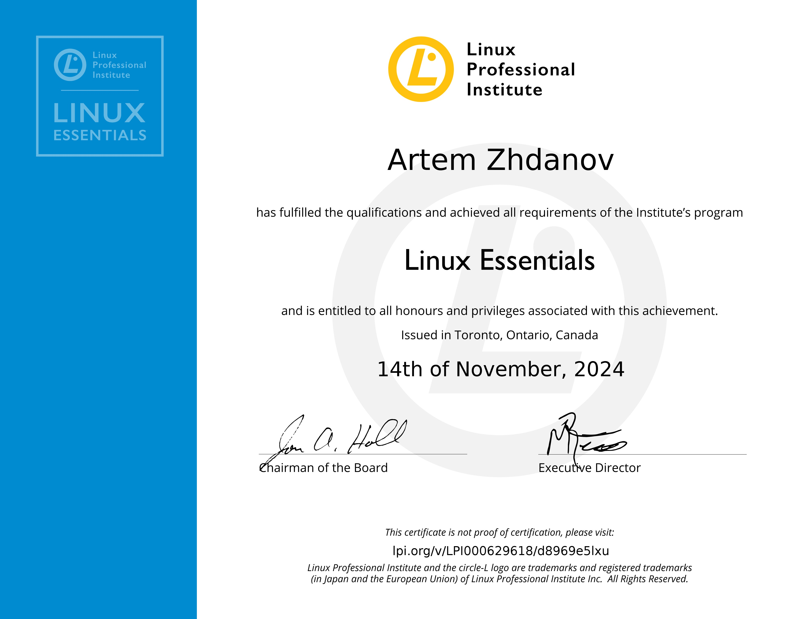
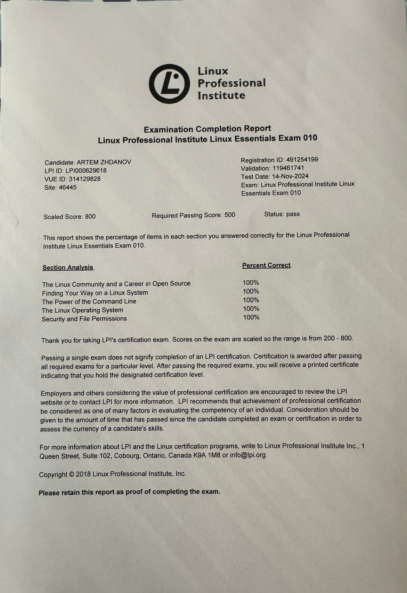

# Artem Zhdanov

**ID Number:** 345695472  
**Address:** Givatayim, HaKnesset St. 32, Israel  
**Date of Birth:** April 18, 1994  
**Phone:** +972-53-3578413  
**Email:** [strrazv@gmail.com](mailto:strrazv@gmail.com)  
**GitHub:** [https://github.com/aazh94/cv_artem_zhdanov](https://github.com/aazh94/cv_artem_zhdanov)  
**LinkedIn:** [https://www.linkedin.com/in/artem-zhdanov-0225a5289/](https://www.linkedin.com/in/artem-zhdanov-0225a5289/)  

---

## Education

**Netology**  
*Linux System Administration (410-hour course)*  
*September 2023 - October 2024 (expected)*  
- Comprehensive introduction to Linux-based operating systems
- User management, file management, network configuration, and automation
- Bash scripting, virtualization, CI/CD, Git, and Docker
- System reliability, data management, and backup solutions

**Minhaltech**  
*Computer Technician (Windows)*  
*October 2023 - July 2024*  
- Troubleshooting and advanced equipment handling
- Motherboard models and modern storage media configuration
- Installation and troubleshooting of multimedia and video systems
- Computer networks, printer installation, and device configuration

**Perm State University**  
*Bachelor of Law*  
*September 2012 - June 2017*  
- Legal studies with a focus on corporate law and residential building management

---

## Certificates

- Linux Essentials (LPI, November 2024)

---

## Work Experience

**Website Administrator**  
*Autonomous Non-Profit Organization "Perm City Consultation Center for Housing and Utilities"*  
*Site* [жкх-пермь.рф](https://xn----jtbbqmqi0b6d.xn--p1ai/)  
*December 2020 – July 2023*  

- Managed website content using MODX Revolution CMS, including adding news, uploading images, and maintaining site structure
- Administered user accounts and access controls for administrators
- Moderated user comments and ensured compliance with guidelines
- Monitored system security and addressed vulnerabilities

**Corporate Lawyer**  
*LLC "Development Strategies"*  
*2014 – 2022*  
- Provided legal counsel to corporate clients
- Managed legal documentation and corporate compliance

---

## Skills

- **Operating Systems:** Linux (Ubuntu, CentOS), Windows
- **Tools & Technologies:**  Bash, Git, Ansible, Docker, Terraform, Virtualization (VirtualBox, VMware), Active Directory
- **Networking:** VPN setup (WireGuard, OpenVPN), Network configuration and troubleshooting
- **Monitoring & Visualization:** Zabbix, Grafana, Kibana

---

## Projects

**Personal VPN Service**  
*Platform: DigitalOcean*  
- Developed a VPN service using WireGuard and OpenVPN
- Managed server setup and maintenance in Amsterdam
- Provided secure internet access for family and friends in Russia

---

## Languages

- **Hebrew:** Fluent  
- **English:** Fluent  
- **Russian:** Native
---

## Certificates
 

